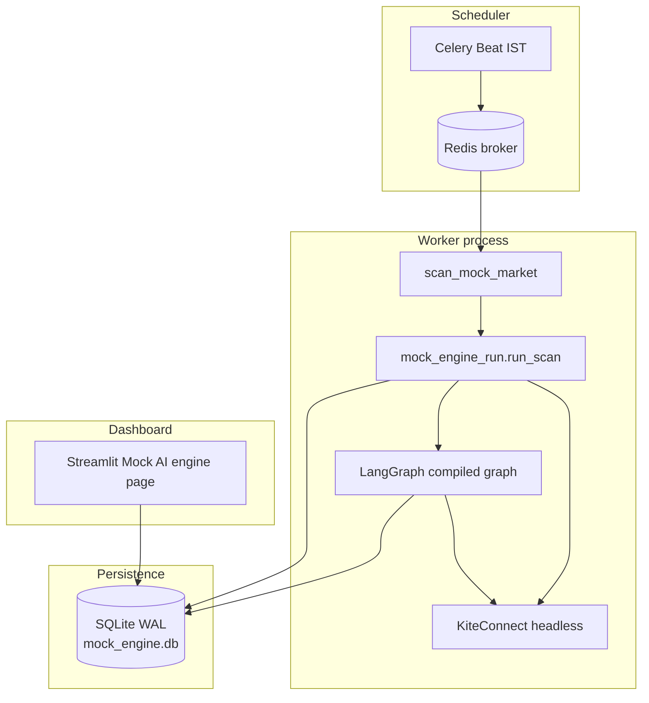
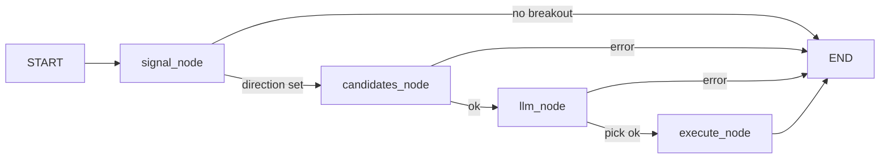

# Autonomous mock trading engine — flow and architecture

This document describes how the **NSE index options mock engine** works in trade-claw: what runs when, which modules participate, and how data moves from Kite → Celery → LangGraph → SQLite → Streamlit.

It reflects the implementation in `trade_claw/mock_engine_run.py`, `trade_claw/mock_trading_graph.py`, `trade_claw/mock_market_signal.py`, `trade_claw/mock_trade_store.py`, and `trade_claw/kite_headless.py`.

---

## 1. Purpose and boundaries

- **Mock only**: no `place_order` or live broker execution. Rows in `mock_trades` represent simulated long-premium trades.
- **Underlying**: Configurable NSE index spot series (`MOCK_ENGINE_UNDERLYINGS`, default all keys in `FO_INDEX_UNDERLYING_KEYS`) via `fetch_underlying_intraday`. Each minute tick runs the LangGraph **once per index** that has **no** `OPEN` row for that `index_underlying`; each run evaluates the envelope on **that** index only (`signal_underlying` in initial state).
- **Options**: NFO contracts on **that** index; **long-only** — bullish signals trade **CE** only, bearish **PE** only (the opposite leg is never shown to the LLM).
- **Concurrency model**: Celery Beat triggers a scan **about once per minute** on weekdays during configured hours; Streamlit only **reads** the SQLite database and does not drive the loop.

---

## 2. High-level architecture

| Layer | Role |
| :--- | :--- |
| **Celery Beat** | Fires `trade_claw.scan_mock_market` on a crontab (IST, weekdays, hours 9–15). |
| **Celery worker** | Executes `run_scan_safe()` → `run_scan()`. |
| **Kite headless** | Builds `KiteConnect` from `KITE_API_KEY` + token (`.kite_session.json` or `KITE_ACCESS_TOKEN`). |
| **LangGraph** | Multi-step flow: signal → candidates → LLM → execute (insert open row). |
| **SQLite** | `mock_trades` table + LangGraph checkpoint tables in the same file (`MOCK_TRADES_DB_PATH`), WAL mode. |
| **Streamlit** | Live tab fragment auto-refresh **every 10 seconds** (Kite + charts + SQLite); optional **Refresh quotes & charts** button for immediate full rerun; Beat remains **every minute**. |

---

## 3. End-to-end lifecycle of one scan (`run_scan`)

Each invocation of `run_scan()` (from `trade_claw/mock_engine_run.py`) follows this **strict order**.

### Step 0 — Initialise storage

- `mock_trade_store.init_db()` ensures the database file exists, applies `PRAGMA journal_mode=WAL`, and creates `mock_trades` (and indexes) if needed.

### Step 1 — Resolve “now” and session date

- Wall clock in **Asia/Kolkata** (`now_ist()`).
- **Session calendar date** for instruments and DTE is `session_date_ist(dt)` (the IST calendar date of that moment).

### Step 2 — Build Kite client

- `get_kite_headless()` (`trade_claw/kite_headless.py`).
- Failure (missing key/token) → return a result dict with `skipped` set; **no** graph run.

### Step 3 — Weekend short-circuit

- If `weekday() >= 5` → `skipped: "weekend"` and exit.

### Step 4 — Manage open positions (always before new entries)

**4a — Stop / target on option LTP** (`process_stop_target_exits`)

- For each row with `status = OPEN`, fetch option **LTP** via `kite.ltp(["NFO:<tradingsymbol>"])`.
- **Long premium** logic:
  - If `target > entry` and `ltp >= target` → close (take profit).
  - Else if `stop < entry` and `stop > 0` and `ltp <= stop` → close (stop loss).
- **Exit price**: `max(0.01, ltp - slippage)` where slippage is a random draw in `[MOCK_AGENT_SLIPPAGE_LO, MOCK_AGENT_SLIPPAGE_HI]` (same family as entry).
- **Realised PnL**: `(exit_price - entry_price) * quantity`, then row updated to `CLOSED` with `exit_time`, `exit_price`, `realized_pnl`.

**4b — 15:20 IST square-off** (`should_force_square_off` + `force_square_off_all`)

- If IST time is **≥ 15:20** on a weekday:
  - Every remaining `OPEN` row is closed at synthetic LTP (again `ltp - slippage`).
  - The function returns immediately with `skipped: "after_square_off_window"` so **no new LangGraph entry** runs in that tick (and subsequent ticks the same day after 15:20 also hit this branch first).

### Step 5 — Gate new entries

If **not** in the force square-off branch, the scan continues:

- **`in_entry_window`**: new mock entries are allowed only on weekdays when IST time is **≥ 09:15** and **< 15:20** (aligned with “no new risk” after the square-off window).
- **Per index**: there is **no** global “flat only” gate. For each key `u` in `MOCK_ENGINE_UNDERLYINGS`, if **`has_open_trade_for_underlying(u)`** is true, that index’s graph run is skipped for this tick (`runs` entry with `skipped: "open_position"`). Otherwise `invoke_mock_graph(..., initial_state={"signal_underlying": u})` runs.

### Step 6 — Load instrument masters

- `kite.instruments("NSE")` and `kite.instruments("NFO")` for the graph’s signal and option filtering.

### Step 7 — Run LangGraph (once per flat index) with SQLite checkpointer

- Open **one** `SqliteSaver.from_conn_string(<absolute path to MOCK_TRADES_DB_PATH>)` for the whole loop (plain path string, not a `sqlite://` URL — required by LangGraph’s saver).
- For each `u` in `MOCK_ENGINE_UNDERLYINGS` without an open leg for `u`, compile+invoke with a **fresh `thread_id` per invocation** so checkpoint rows do not collide across parallel logical runs in the same tick.

The Celery result `graph` field holds **`runs`** (list of per-underlying outcomes) and **`per_underlying`** (map keyed by index). Telemetry `last_graph` stores **`tick_ist`**, **`runs`**, and **`per_underlying`** for the Streamlit HUD.

---

## 4. LangGraph internals (`mock_trading_graph.py`)

The graph is built per invocation with **closure** over `kite`, `session_d`, `nse_instruments`, and `nfo_instruments` (so checkpointed state stays JSON-serialisable).

### Node: `signal`

1. If **`signal_underlying`** is set in state (Celery passes one index per invoke), only that key is scanned (must appear in **`MOCK_ENGINE_UNDERLYINGS`**). Otherwise the node scans **all** keys in order (legacy single-invoke behaviour).
2. For each key in that list, loads **full session** spot **1-minute** candles for `session_d` from **09:15 to 15:30** (`load_index_session_minute_df` → `fetch_underlying_intraday`).
3. Runs `envelope_breakout_on_last_bar` with **20-period EMA** and bandwidth **`MOCK_AGENT_ENVELOPE_PCT`** (decimal per side; default **`constants.ENVELOPE_PCT`** = **0.0030** = **0.30%** each side of EMA20 — same geometry as `strategies._envelope_series`). Set env to widen (e.g. `0.01` for 1% per side).
4. **Trigger** (on the **latest** completed bar only): **first** key in the **scan list** that shows a fresh cross wins; state includes **`underlying`** (the index key).
   - Close crosses **above** upper band → **BULLISH**, leg **CE**.
   - Close crosses **below** lower band → **BEARISH**, leg **PE**.
5. If no key in the scan list produces a cross → state gets aggregated `signal_text` / `notes`; routing sends flow to **END** (no LLM).

### Node: `candidates`

1. Filters NFO instruments to **that signal’s index** (`state["underlying"]`) and the chosen leg only (`top_five_option_instruments`).
2. Uses **nearest expiry on or after** `session_d`.
3. Builds **five** strikes around ATM (ladder steps −2 … +2, deduplicated, padded if the chain is thin).
4. Enriches each with **LTP** (batch `kite.ltp`), **DTE**, `lot_size`, etc., for the LLM prompt.

### Node: `llm`

1. **Structured output** (`LLMPick`): `tradingsymbol`, `stop_loss`, `target`, `rationale` (premium prices, not index points).
2. Validates `tradingsymbol` is **exactly** one of the five candidates.

### Node: `execute`

1. Re-reads LTP for the chosen symbol.
2. **Entry (mock BUY)**: `entry_price = max(0.01, ltp - slippage)` with slippage in the configured rupee range.
3. Clamps **target** above entry and **stop** below entry if the model returns inconsistent premium levels (stop floor: **`MOCK_ENGINE_STOP_LOSS_CLAMP_PCT`**, default 30% below entry).
4. Sizes with `fo_lot_qty_for_allocation` and `ALLOCATED_AMOUNT` → whole lots → `quantity` = units for PnL.
5. **`insert_open_trade`** (includes **`index_underlying`**, normalized uppercase) → new `OPEN` row (`mock_trade_store`). At most **one** `OPEN` row per `index_underlying` (enforced by pre-insert check, **`IntegrityError`** handling, and partial unique index **`idx_mock_trades_one_open_per_index`** where possible).

There is **no** explicit `transaction_type` column in SQLite; behaviour is **BUY** on insert and **SELL** on close in the sense that exits are always closing the long (synthetic sell at LTP minus slippage).

---

## 5. What Celery Beat actually schedules

Configured in `trade_claw/celery_app.py`:

- **Timezone**: `Asia/Kolkata`, `enable_utc=False`.
- **Schedule**: every minute, hours **9–15**, **Monday–Friday** (`day_of_week='1-5'`).
- **Task name**: `trade_claw.scan_mock_market` → `run_scan_safe()`.

**Important:** Beat still fires at 09:00–09:14 and after 15:30 on weekdays. **In-task guards** (`in_entry_window`, `should_force_square_off`, weekend check) restrict **meaningful** behaviour to the intended NSE-style windows. After **15:20**, every tick first attempts square-off (idempotent if already flat) then exits without opening new trades.

---

## 6. SQLite schema (`mock_trade_store.py`)

Core columns match the product blueprint; two extra columns support realistic PnL:

| Column | Meaning |
| :--- | :--- |
| `trade_id` | Primary key |
| `entry_time` / `exit_time` | Timestamps (UTC string convention in code) |
| `instrument` | NFO `tradingsymbol` |
| `direction` | `BULLISH` / `BEARISH` |
| `entry_price` | Simulated **buy** fill (LTP minus slippage) |
| `stop_loss` / `target` | Premium levels from LLM (possibly clamped) |
| `llm_rationale` | Model explanation |
| `status` | `OPEN` / `CLOSED` |
| `exit_price` / `realized_pnl` | Set on close |
| `lot_size` | Exchange lot size used for sizing |
| `quantity` | Total units (lots × lot size) for PnL |
| `index_underlying` | NSE index key used for the signal (`NIFTY`, `BANKNIFTY`, …); nullable on legacy rows; **unique among `OPEN` rows** when the partial index is present |
| `entry_bars_json` / `exit_bars_json` | Optional JSON arrays of **option** minute OHLC (see `MOCK_ENGINE_SNAPSHOT_BARS`) |
| `entry_underlying_bars_json` / `exit_underlying_bars_json` | Optional JSON arrays of **index spot** minute OHLC for that trade’s `index_underlying` (same bar cap) |

WAL allows concurrent **writer** (Celery) and **reader** (Streamlit).

### Long-horizon analysis (no Kite backfill)

For **months** of history, analytics are driven only from **`mock_trades`**. Kite does **not** reliably provide **minute** history for **old / expired** option contracts, so do not depend on re-fetching option intraday charts for past trades.

Streamlit **Mock AI engine → Analytics** tab uses [`mock_trade_analytics.py`](trade_claw/mock_trade_analytics.py): IST calendar date range → UTC SQL bounds on `entry_time`, KPIs, monthly PnL, equity curve by `exit_time`, direction breakdown, CSV export, and optional **replay** of stored entry/exit snapshots. Replay draws **index spot** candles (labelled from `index_underlying`) plus **EMA envelope** when underlying JSON exists, and **option** candles with horizontal **entry / target / stop / exit** lines from the trade row (same rules as the Live option chart).

### Telemetry (`mock_engine_telemetry.py`)

Table **`mock_engine_telemetry`** (single row `id = 1`) stores JSON:

- **`last_scan`**: written on **every** worker tick — IST timestamp, `skipped` reason, exit counts, live **`nifty_ltp`** (legacy: first open trade’s index or first configured underlying), **`open_option_ltp`** (first open leg), **`open_options_ltps`** (all open legs with LTP), `open_trades_detail`, `agent_envelope_pct`, `agent_ema_period`, and **`graph`** (`runs` + `per_underlying`).
- **`last_graph`**: per-tick bundle: **`tick_ist`**, **`runs`** (one entry per configured index — signal/LLM payload, `skipped`, or `error`), and **`per_underlying`**. Legacy single-invoke shape (flat dict) may still appear in old snapshots until the next worker tick.

---

## 7. Worker logging (`[mock_market_scan]`)

Trade and scan events use logger **`trade_claw.mock_market_scan`** with a consistent prefix **`[mock_market_scan]`** and a colored event badge when **stderr is a TTY** (typical interactive Celery worker). Examples: **`[tick_start]`**, **`[exit_target]`** / **`[exit_stop]`** / **`[exit_square]`**, **`[OPEN]`** (new row), **`[SIGNAL]`**, **`[LLM_PICK]`**, **`[GRAPH]`** / **`[graph_err]`**, **`[celery]`**.

- Disable colors: **`NO_COLOR=1`** or **`MOCK_ENGINE_LOG_COLOR=0`**.
- Plain files / non-TTY: same messages without ANSI escape codes.

---

## 8. Daily operations (operator view)

1. **Morning**: Start **Redis**, **Celery worker**, **Celery beat** (see `README.md`).
2. **Kite session**: Log in via Streamlit once so `.kite_session.json` is written on the **same machine** as the worker, or export `KITE_ACCESS_TOKEN`.
3. **OpenAI**: Set `OPENAI_API_KEY` (and optionally `OPENAI_MODEL`) for the LLM node.
4. **Monitoring**: Streamlit → **Mock AI engine** — **Live** tab: auto-refreshing quotes/charts + telemetry; **Analytics** tab: multi-month stats from `mock_trades`, CSV export, snapshot replay (if enabled).
5. **End of day**: After **15:20 IST**, open rows are closed; Beat may still enqueue tasks until hour 15 ends, but logic stays idempotent.

---

## 9. Key environment variables

| Variable | Purpose |
| :--- | :--- |
| `KITE_API_KEY` | Kite app key |
| `KITE_ACCESS_TOKEN` | Optional override if not using `.kite_session.json` |
| `OPENAI_API_KEY` / `OPENAI_MODEL` | LLM node |
| `MOCK_TRADES_DB_PATH` | SQLite file path (default under `data/`) |
| `MOCK_AGENT_ENVELOPE_PCT` | EMA envelope bandwidth **per side** as decimal (default **`ENVELOPE_PCT`** in code = **0.0030** = 0.30% each side of EMA20) |
| `MOCK_AGENT_SLIPPAGE_LO` / `MOCK_AGENT_SLIPPAGE_HI` | Slippage range (rupees) |
| `MOCK_ENGINE_SNAPSHOT_BARS` | Max 1m bars stored **per leg** for option **and** index spot snapshots at entry/exit (`0` = off, default `60`) |
| `MOCK_ENGINE_UNDERLYINGS` | Comma-separated index keys; each minute tick runs the graph once per key with no OPEN row for that index. |
| `MOCK_ENGINE_STOP_LOSS_CLAMP_PCT` | If LLM `stop_loss ≥ entry`, replace with `entry × (1 − pct/100)` (default **30** → 30% below entry; was hard-coded 15% before). Allowed range clamped 5–90. |
| `MOCK_ENGINE_LOG_COLOR` | `1` (default): ANSI colors for `[mock_market_scan]` logs in a TTY; `0` / `false` to disable (also respects `NO_COLOR`). |
| `REDIS_URL` / `CELERY_BROKER_URL` / `CELERY_RESULT_BACKEND` | Celery |

See `.env.example` for commented templates.

---

## 10. Source file map

| File | Responsibility |
| :--- | :--- |
| `trade_claw/celery_app.py` | Celery app, IST, beat schedule |
| `trade_claw/worker_tasks.py` | `scan_mock_market` task |
| `trade_claw/mock_engine_run.py` | Per-tick orchestration, exits, graph invoke |
| `trade_claw/mock_engine_log.py` | Colored `[mock_market_scan]` log helpers (`trade_claw.mock_market_scan` logger) |
| `trade_claw/mock_trading_graph.py` | LangGraph definition and `invoke_mock_graph` |
| `trade_claw/mock_market_signal.py` | IST helpers, envelope breakout, top-five strikes |
| `trade_claw/mock_trade_store.py` | CRUD + WAL connection |
| `trade_claw/mock_trade_analytics.py` | Date-range queries + pandas summaries for Analytics tab |
| `trade_claw/mock_trade_snapshot.py` | Optional minute-bar JSON at entry/exit |
| `trade_claw/kite_headless.py` | Worker-safe Kite auth |
| `trade_claw/mock_engine_telemetry.py` | SQLite snapshot for Streamlit (`last_scan` / `last_graph`) |
| `trade_claw/views/mock_engine.py` | Streamlit HUD (telemetry + live Kite charts) |
| `app.py` | Route to mock engine view |

---

## 11. Known simplifications vs a full production stack

- **Instrument load every tick**: Full NSE/NFO masters are downloaded each time the graph runs; acceptable for a mock demo, could be cached.
- **One open row per index**: No second leg on the same underlying until the first closes; several indices may be open at once.
- **Checkpoint thread IDs**: New UUID suffix per scan limits cross-tick LangGraph “memory”; ledger truth is **`mock_trades`**, not the checkpoint.
- **Beat granularity**: Crontab is coarser than “09:15–15:30 only”; correctness relies on **Python time checks** inside `run_scan`.

For behaviour changes, start with `mock_engine_run.run_scan` ordering, then `mock_market_signal` gates, then graph nodes in `mock_trading_graph.py`.
