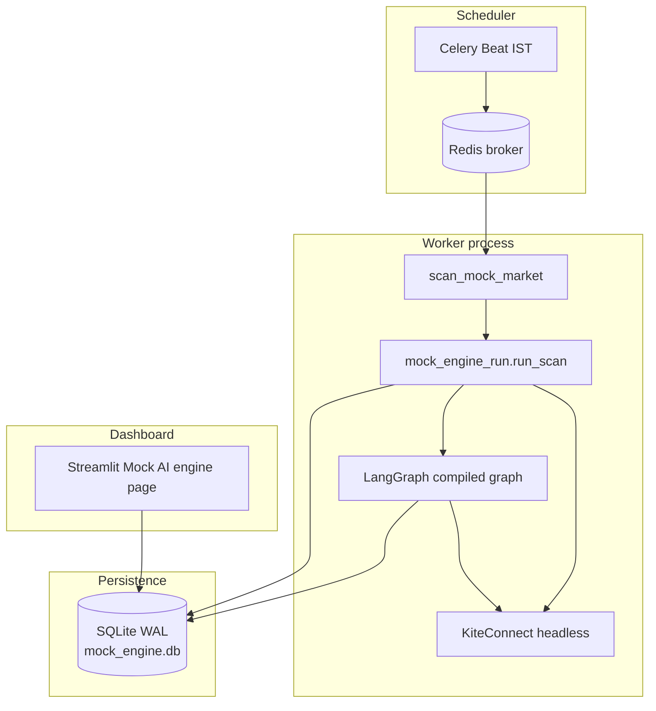
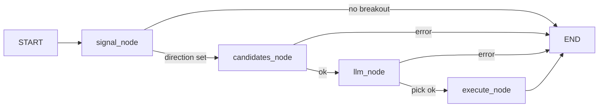

# Autonomous mock trading engine — flow and architecture

This document describes how the **NSE index options mock engine** works in trade-claw: what runs when, which modules participate, and how data moves from Kite → Celery → LangGraph → SQLite → Streamlit.

It reflects the implementation in `trade_claw/mock_engine_run.py`, `trade_claw/mock_trading_graph.py`, `trade_claw/mock_market_signal.py`, `trade_claw/mock_trade_store.py`, and `trade_claw/kite_headless.py`. **Envelope bandwidth and option target/stop** resolve from environment variables in **`trade_claw/env_trading_params.py`** (same module as the F&O Options / F&O Agent pages); see `.env.example` — **Trading defaults**.

**Envelope signal rules** (warmup, fresh cross on the breakout bar, optional penetration vs band, optional clear margin, optional strict filters and 2-bar confirm): [MOCK_ENGINE_BREAKOUT_RULES.md](MOCK_ENGINE_BREAKOUT_RULES.md).

---

## 1. Purpose and boundaries

- **Mock only**: no `place_order` or live broker execution. Rows in `mock_trades` represent simulated long-premium trades.
- **Underlying**: NSE spot series from `mock_engine_underlyings()` in `mock_market_signal.py`. **Default** = `FO_UNDERLYING_OPTIONS` in `trade_claw/constants.py` (same ordered list as the **F&O Options** underlying dropdown). Optional env **`MOCK_ENGINE_UNDERLYINGS`** = comma-separated subset of that list (invalid symbols ignored). Each minute tick runs the LangGraph **once per underlying** that has **no** `OPEN` row for that `index_underlying`; each run evaluates the envelope on **that** symbol only (`signal_underlying` in initial state), via `fetch_underlying_intraday`.
- **Options**: NFO contracts on **that** index; **long-only** — bullish signals trade **CE** only, bearish **PE** only (the opposite leg is never shown to the LLM).
- **Concurrency model**: Celery Beat triggers a scan **about once per minute** on weekdays during configured hours; Streamlit only **reads** the SQLite database and does not drive the loop.

---

## 2. High-level architecture

| Layer | Role |
| :--- | :--- |
| **Celery Beat** | Fires `trade_claw.scan_mock_market` on a crontab (IST, weekdays, hours 9–15). |
| **Celery worker** | Executes `run_scan_safe()` → `run_scan()`. |
| **Kite headless** | Builds `KiteConnect` from `KITE_API_KEY` + token (`.kite_session.json` or `KITE_ACCESS_TOKEN`). |
| **LangGraph** | Multi-step flow: signal → candidates → LLM → execute (insert open row). |
| **SQLite** | `mock_trades` table + LangGraph checkpoint tables in the same file (`MOCK_TRADES_DB_PATH`), WAL mode. |
| **Streamlit** | Live tab fragment auto-refresh **every 10 seconds** (Kite + charts + SQLite); optional **Refresh quotes & charts** button for immediate full rerun; Beat remains **every minute**. |

---

## 3. End-to-end lifecycle of one scan (`run_scan`)

Each invocation of `run_scan()` (from `trade_claw/mock_engine_run.py`) follows this **strict order**.

### Step 0 — Initialise storage

- `mock_trade_store.init_db()` ensures the database file exists, applies `PRAGMA journal_mode=WAL`, and creates `mock_trades` (and indexes) if needed.

### Step 1 — Resolve “now” and session date

- Wall clock in **Asia/Kolkata** (`now_ist()`).
- **Session calendar date** for instruments and DTE is `session_date_ist(dt)` (the IST calendar date of that moment).

### Step 2 — Build Kite client

- `get_kite_headless()` (`trade_claw/kite_headless.py`).
- Failure (missing key/token) → return a result dict with `skipped` set; **no** graph run.

### Step 3 — Weekend short-circuit

- If `weekday() >= 5` → `skipped: "weekend"` and exit.

### Step 4 — Manage open positions (always before new entries)

**4a — Stop / target on option LTP** (`process_stop_target_exits`)

- For each row with `status = OPEN`, fetch option **LTP** via `kite.ltp(["NFO:<tradingsymbol>"])`.
- **Long premium** logic:
  - If `target > entry` and `ltp >= target` → close (take profit).
  - Else if `stop < entry` and `stop > 0` and `ltp <= stop` → close (stop loss).
- **Exit price**: `max(0.01, ltp - slippage)` where slippage is a random draw in `[MOCK_AGENT_SLIPPAGE_LO, MOCK_AGENT_SLIPPAGE_HI]` (same family as entry).
- **Realised PnL**: `(exit_price - entry_price) * quantity`, then row updated to `CLOSED` with `exit_time`, `exit_price`, `realized_pnl`.

**4b — 15:20 IST square-off** (`should_force_square_off` + `force_square_off_all`)

- If IST time is **≥ 15:20** on a weekday:
  - Every remaining `OPEN` row is closed at synthetic LTP (again `ltp - slippage`).
  - The function returns immediately with `skipped: "after_square_off_window"` so **no new LangGraph entry** runs in that tick (and subsequent ticks the same day after 15:20 also hit this branch first).

### Step 5 — Gate new entries

If **not** in the force square-off branch, the scan continues:

- **`in_entry_window`**: new mock entries are allowed only on weekdays when IST time is **≥ 09:15** and **< 15:20** (aligned with “no new risk” after the square-off window).
- **Per underlying**: there is **no** global “flat only” gate. For each key `u` in **`mock_engine_underlyings()`** (default `FO_UNDERLYING_OPTIONS`, or env `MOCK_ENGINE_UNDERLYINGS` subset), if **`has_open_trade_for_underlying(u)`** is true, that underlying’s graph run is skipped for this tick (`runs` entry with `skipped: "open_position"`). Otherwise `invoke_mock_graph(..., initial_state={"signal_underlying": u})` runs.

### Step 6 — Load instrument masters

- `kite.instruments("NSE")` and `kite.instruments("NFO")` for the graph’s signal and option filtering.

### Step 7 — Run LangGraph (once per flat index) with SQLite checkpointer

- Open **one** `SqliteSaver.from_conn_string(<absolute path to MOCK_TRADES_DB_PATH>)` for the whole loop (plain path string, not a `sqlite://` URL — required by LangGraph’s saver).
- For each `u` in **`mock_engine_underlyings()`** without an open leg for `u`, compile+invoke with a **fresh `thread_id` per invocation** so checkpoint rows do not collide across parallel logical runs in the same tick.

The Celery result `graph` field holds **`runs`** (list of per-underlying outcomes) and **`per_underlying`** (map keyed by index). Telemetry `last_graph` stores **`tick_ist`**, **`runs`**, and **`per_underlying`** for the Streamlit HUD.

---

## 4. LangGraph internals (`mock_trading_graph.py`)

The graph is built per invocation with **closure** over `kite`, `session_d`, `nse_instruments`, and `nfo_instruments` (so checkpointed state stays JSON-serialisable).

### Node: `signal`

1. If **`signal_underlying`** is set in state (Celery passes one underlying per invoke), only that key is scanned (must appear in **`mock_engine_underlyings()`**). Otherwise the node scans **all** keys in order (legacy single-invoke behaviour).
2. For each key in that list, loads **full session** spot **1-minute** candles for `session_d` from **09:15 to 15:30** (`load_index_session_minute_df` → `fetch_underlying_intraday`).
3. **Breakout decision** (per scan key): if **`MOCK_LLM_BREAKOUT_FROM_CHART=1`** and **`MOCK_LLM_ATTACH_UNDERLYING_CHART=1`**, a **vision LLM** classifies the same PNG chart (EMA envelope, assessment title) as breakout or not; on **decline**, that underlying is skipped for this tick (no deterministic envelope fallback for that symbol). If the PNG cannot be built or the API call fails, the worker uses **`envelope_breakout_on_last_bar`** as today. Otherwise (flags off), only the deterministic rule runs: **`envelope_breakout_on_last_bar`** with **20-period EMA** and bandwidth from **`env_trading_params.mock_engine_envelope_decimal_per_side(underlying)`** per scan key: **index** keys (`NIFTY`, `BANKNIFTY`, `MIDCPNIFTY` — `FO_INDEX_UNDERLYING_KEYS`) use optional **`MOCK_AGENT_INDEX_ENVELOPE_PCT`** when set; otherwise they use the same decimal as equities from **`fno_envelope_decimal_per_side()`** (env **`MOCK_AGENT_ENVELOPE_PCT`**; default **0.25** = **25%** each side when unset). Tighter bands: e.g. `MOCK_AGENT_ENVELOPE_PCT=0.003` or `MOCK_AGENT_INDEX_ENVELOPE_PCT=0.003` for indices only. Geometry matches `strategies._envelope_series` when the same decimal is passed as `pct`. The dataframe must pass a **warmup** bar count (depends on optional strict filters and confirm bar; see [MOCK_ENGINE_BREAKOUT_RULES.md](MOCK_ENGINE_BREAKOUT_RULES.md)). Optional **breakout penetration** (% of breakout bar range past the band, same rule as the F&O page) comes from **`FO_BREAKOUT_PENETRATION_MIN_PCT`** / **`fo_breakout_penetration_min_pct`** (`env_trading_params.fo_breakout_penetration_min_frac()`; **`0`** = off). An optional **clear break** past the band is enforced when `MOCK_ENGINE_BREAKOUT_CLEAR_PCT` is non-zero (`env_trading_params.mock_engine_breakout_clear_pct()`). Optional **strict** body / wick / range / volume / directional-body filters and **`MOCK_ENGINE_BREAKOUT_REQUIRE_CONFIRM_BAR`** are documented in the same file.
4. **Trigger**: **first** key in the **scan list** that shows a valid breakout wins; state includes **`underlying`** (the index key). **Spot** and **signal_bar_time** use the **confirm** bar when two-bar confirm is enabled, else the breakout (latest) bar.
   - Close crosses **above** upper band (and clear-break rules if configured) → **BULLISH**, leg **CE**.
   - Close crosses **below** lower band (and clear-break rules if configured) → **BEARISH**, leg **PE**.
5. If no key in the scan list produces a cross → state gets aggregated `signal_text` / `notes`; routing sends flow to **END** (no LLM).

### Node: `candidates`

1. Filters NFO instruments to **that signal’s index** (`state["underlying"]`) and the chosen leg only (`top_five_option_instruments`).
2. Uses **nearest expiry on or after** `session_d`.
3. Builds **five** strikes around ATM (ladder steps −2 … +2, deduplicated, padded if the chain is thin).
4. Enriches each with **LTP** (batch `kite.ltp`), **DTE**, `lot_size`, etc., for the LLM prompt.

### Node: `llm`

1. **Structured output** (`LLMPick`): `tradingsymbol`, `rationale`, **`stop_loss`**, **`target`** — option **premium** levels in **₹** for the chosen contract. The system prompt injects suggested % distances from `option_stop_premium_fraction` / `option_target_premium_fraction`, hard **min/max % bands** from `mock_llm_sltp_target_pct_bounds` / `mock_llm_sltp_stop_pct_bounds` (env `MOCK_LLM_SLTP_*` or derived defaults), and optional operator text from **`MOCK_LLM_RISK_INSTRUCTION`**.
2. **Optional chart context** (`MOCK_LLM_ATTACH_UNDERLYING_CHART`): before the LLM call, the worker reloads the same **1-minute** session OHLC for `state["underlying"]`, renders a **static PNG** (Plotly + **Kaleido**) with **candlesticks**, the **same EMA envelope** as the signal (`ENVELOPE_EMA_PERIOD`, `mock_agent_envelope_pct()`), and a **vertical marker** at the signal bar time. The user message is then **multimodal** (text + `image_url` data-URL). If Kaleido is missing, export fails, or the model rejects the request, the code **logs** and **retries once** with the original **text-only** message and the default `ChatOpenAI` instance (`OPENAI_MODEL`). When a chart is present, **`MOCK_LLM_VISION_MODEL`** may be set to a **vision-capable** model name; if unset, `OPENAI_MODEL` is used for that call (it must support images when the flag is on).
3. Optional **prompt trace** (`MOCK_LLM_PROMPT_LOG_DIR`): writes the first LLM attempt’s system text, human text, chart PNG (if any), and after the model returns, **`llm_output.json`** (structured pick + `_llm_invoke_path`, `_symbol_in_candidate_list`). If the invoke fails entirely, **`llm_error.json`** is written instead. Only runs in this node (i.e. after a real signal and successful candidates).
4. Validates `tradingsymbol` is **exactly** one of the five candidates.

### Node: `execute`

1. Re-reads LTP for the chosen symbol.
2. **Entry (mock BUY)**: `entry_price = max(0.01, ltp - slippage)` with slippage in the configured rupee range.
3. **Stop / target**: `_resolve_entry_sltp` validates LLM **`stop_loss`** and **`target`** vs **`entry`**: require `0 < stop < entry < target`, and rupee levels within the env **percent bands** (see `env_trading_params.mock_llm_sltp_*`). Values are **rounded** to two decimals. If validation fails and **`MOCK_LLM_SLTP_FALLBACK=1`**, stop/target fall back to the same **env multipliers** as before (`mock_engine_option_stop_multiplier` / `mock_engine_option_target_multiplier`). If validation fails and fallback is **off**, the node returns **`error`** and does **not** insert.
4. **`quantity`** = one exchange **lot** (`lot_size` units) for PnL.
5. **`insert_open_trade`** (includes **`index_underlying`**, normalized uppercase) → new `OPEN` row (`mock_trade_store`). At most **one** `OPEN` row per `index_underlying` (enforced by pre-insert check, **`IntegrityError`** handling, and partial unique index **`idx_mock_trades_one_open_per_index`** where possible).

There is **no** explicit `transaction_type` column in SQLite; behaviour is **BUY** on insert and **SELL** on close in the sense that exits are always closing the long (synthetic sell at LTP minus slippage).

---

## 5. What Celery Beat actually schedules

Configured in `trade_claw/celery_app.py`:

- **Timezone**: `Asia/Kolkata`, `enable_utc=False`.
- **Schedule**: every minute, hours **9–15**, **Monday–Friday** (`day_of_week='1-5'`).
- **Task name**: `trade_claw.scan_mock_market` → `run_scan_safe()`.

**Important:** Beat still fires at 09:00–09:14 and after 15:30 on weekdays. **In-task guards** (`in_entry_window`, `should_force_square_off`, weekend check) restrict **meaningful** behaviour to the intended NSE-style windows. After **15:20**, every tick first attempts square-off (idempotent if already flat) then exits without opening new trades.

---

## 6. SQLite schema (`mock_trade_store.py`)

Core columns match the product blueprint; two extra columns support realistic PnL:

| Column | Meaning |
| :--- | :--- |
| `trade_id` | Primary key |
| `entry_time` / `exit_time` | Timestamps (UTC string convention in code) |
| `instrument` | NFO `tradingsymbol` |
| `direction` | `BULLISH` / `BEARISH` |
| `entry_price` | Simulated **buy** fill (LTP minus slippage) |
| `stop_loss` / `target` | Premium levels from validated LLM output (or env multipliers when `MOCK_LLM_SLTP_FALLBACK=1`) |
| `llm_rationale` | Model explanation |
| `status` | `OPEN` / `CLOSED` |
| `exit_price` / `realized_pnl` | Set on close |
| `lot_size` | Exchange lot size used for sizing |
| `quantity` | Total units (lots × lot size) for PnL |
| `index_underlying` | NSE index key used for the signal (`NIFTY`, `BANKNIFTY`, …); nullable on legacy rows; **unique among `OPEN` rows** when the partial index is present |
| `entry_bars_json` / `exit_bars_json` | Optional JSON arrays of **option** minute OHLC: **entry** = trailing window (`MOCK_ENGINE_SNAPSHOT_BARS`); **exit** = bars from **`entry_time`** (UTC per `mock_trade_store`) through session at close, capped by **`MOCK_ENGINE_SNAPSHOT_EXIT_MAX_BARS`**. If `entry_time` is unparseable, the earliest bar in **`entry_bars_json`** / **`entry_underlying_bars_json`** is used as the start; if neither yields a threshold, the **full** session up to the cap is stored (not a last-N tail of the day). |
| `entry_underlying_bars_json` / `exit_underlying_bars_json` | Optional JSON arrays of **underlying spot** minute OHLC (same entry vs exit rules as option snapshots) |

WAL allows concurrent **writer** (Celery) and **reader** (Streamlit).

### Long-horizon analysis (no Kite backfill)

For **months** of history, analytics are driven only from **`mock_trades`**. Kite does **not** reliably provide **minute** history for **old / expired** option contracts, so do not depend on re-fetching option intraday charts for past trades.

Streamlit **Mock AI engine → Analytics** tab uses [`mock_trade_analytics.py`](trade_claw/mock_trade_analytics.py): IST calendar date range → UTC SQL bounds on `entry_time`, KPIs, monthly PnL, equity curve by `exit_time`, direction breakdown, CSV export, and optional **replay** of stored minute snapshots. **Replay** merges **entry + exit** JSON on one time axis for both **underlying spot** (envelope) and **option premium**: **exit** snapshots include the full **entry→exit** hold window (so intra-trade candles are visible for new closes), while **entry** snapshots add earlier session context where they overlap. **F&O Options–style** chart with **entry** (cyan triangle) and **exit** (gold diamond) markers aligned to `entry_time` / `exit_time`, plus dashed **target** / **stop** lines from the trade row. Stored **`llm_rationale`** is shown above the option chart when present. The **Live** tab open-leg option chart uses the same marker and target/stop styling for the current session (live Kite 1m), with an entry marker at the bar nearest `entry_time`.

**Refetch exit snapshots:** In the Analytics replay expander, **Refetch exit snapshots from Kite & save** re-downloads the same hold-window slices as the worker and overwrites `exit_bars_json` / `exit_underlying_bars_json` for the selected `trade_id` (requires Kite session and **`MOCK_ENGINE_SNAPSHOT_BARS` > 0**). If Kite returns no data for a leg (typical for **expired** option symbols), the previous JSON for that leg is left unchanged. CLI equivalent: `python -m trade_claw.refetch_mock_exit_snapshots 42` or `python -m trade_claw.refetch_mock_exit_snapshots --recent-closed 20` (implementation: [`trade_claw/refetch_mock_exit_snapshots.py`](trade_claw/refetch_mock_exit_snapshots.py)).

### Telemetry (`mock_engine_telemetry.py`)

Table **`mock_engine_telemetry`** (single row `id = 1`) stores JSON:

- **`last_scan`**: written on **every** worker tick — IST timestamp, `skipped` reason, exit counts, live **`nifty_ltp`** (legacy: first open trade’s index or first configured underlying), **`open_option_ltp`** (first open leg), **`open_options_ltps`** (all open legs with LTP), `open_trades_detail`, `agent_envelope_pct` (equity/default envelope decimal), **`agent_envelope_pct_index`** (resolved envelope for **`NIFTY`** after **`MOCK_AGENT_INDEX_ENVELOPE_PCT`** rules), `agent_ema_period`, and **`graph`** (`runs` + `per_underlying`).
- **`last_graph`**: per-tick bundle: **`tick_ist`**, **`runs`** (one entry per configured index — signal/LLM payload, `skipped`, or `error`), and **`per_underlying`**. Legacy single-invoke shape (flat dict) may still appear in old snapshots until the next worker tick.

---

## 7. Worker logging (`[mock_market_scan]`)

Trade and scan events use logger **`trade_claw.mock_market_scan`** with a consistent prefix **`[mock_market_scan]`** and a colored event badge when **stderr is a TTY** (typical interactive Celery worker). Examples: **`[tick_start]`**, **`[exit_target]`** / **`[exit_stop]`** / **`[exit_square]`**, **`[OPEN]`** (new row), **`[SIGNAL]`**, **`[LLM_PICK]`**, **`[GRAPH]`** / **`[graph_err]`**, **`[celery]`**.

- Disable colors: **`NO_COLOR=1`** or **`MOCK_ENGINE_LOG_COLOR=0`**.
- Plain files / non-TTY: same messages without ANSI escape codes.

---

## 8. Daily operations (operator view)

1. **Morning**: Start **Redis**, **Celery worker**, **Celery beat** (see `README.md`).
2. **Kite session**: Log in via Streamlit once so `.kite_session.json` is written on the **same machine** as the worker, or export `KITE_ACCESS_TOKEN`.
3. **OpenAI**: Set `OPENAI_API_KEY` (and optionally `OPENAI_MODEL`) for the LLM node.
4. **Monitoring**: Streamlit → **Mock AI engine** — **Live** tab: auto-refreshing quotes/charts + telemetry (open option chart: F&O-style entry marker + target/stop); **Analytics** tab: multi-month stats from `mock_trades`, CSV export, merged snapshot replay + rationale (if enabled).
5. **End of day**: After **15:20 IST**, open rows are closed; Beat may still enqueue tasks until hour 15 ends, but logic stays idempotent.

### Docker Compose

Telemetry (`last_scan` / `last_graph`) and mock trades live in the same SQLite file as **`MOCK_TRADES_DB_PATH`** (default **`data/mock_engine.db`**). The **Celery worker** writes that file; **Streamlit** reads it. If both run in separate containers **without** a shared **`/app/data`** volume, the UI will show an empty **`last_scan`** (`{}`) even when the worker is healthy — each container has its own copy of `data/`. The repo **`docker-compose.yml`** mounts a named volume on **`streamlit`** and **`celery-worker`** so they share **`/app/data`**.

**Kite login in Docker:** The worker calls Kite with **`get_kite_headless()`** — it does **not** use the Streamlit session in memory. It needs **`KITE_ACCESS_TOKEN`** in `.env`, or a **session JSON file** whose path matches on both containers. Compose sets **`KITE_SESSION_FILE=/app/data/.kite_session.json`** so after you log in via Streamlit, the token is saved next to the SQLite DB on the **shared** volume and the worker can read it. If you still see **`Incorrect api_key` or `access_token`**, regenerate the token (log in again), confirm **`KITE_API_KEY`** matches the app you logged into, or set **`KITE_ACCESS_TOKEN`** explicitly for the worker.

---

## 9. Key environment variables

| Variable | Purpose |
| :--- | :--- |
| `KITE_API_KEY` | Kite app key |
| `KITE_ACCESS_TOKEN` | Optional override if not using `.kite_session.json` |
| `OPENAI_API_KEY` / `OPENAI_MODEL` | LLM node |
| `MOCK_TRADES_DB_PATH` | SQLite file path (default under `data/`) |
| `MOCK_AGENT_ENVELOPE_PCT` | EMA envelope bandwidth **per side** as decimal (default **0.25** = **25%** each side of EMA20); parsed in `env_trading_params.fno_envelope_decimal_per_side` (mock equities + default for indices when index override unset) |
| `MOCK_AGENT_INDEX_ENVELOPE_PCT` | Optional: mock engine only — per-side decimal for **`FO_INDEX_UNDERLYING_KEYS`** (`NIFTY`, `BANKNIFTY`, `MIDCPNIFTY`); when unset, indices use `MOCK_AGENT_ENVELOPE_PCT` |
| `MOCK_AGENT_SLIPPAGE_LO` / `MOCK_AGENT_SLIPPAGE_HI` | Slippage range (rupees) |
| `MOCK_ENGINE_SNAPSHOT_BARS` | Max 1m bars in **entry** trailing snapshots for option and spot (`0` = off, default `60`) |
| `MOCK_ENGINE_SNAPSHOT_EXIT_MAX_BARS` | Cap on **exit** snapshots: minute bars from trade **`entry_time`** through close (default **500**) |
| `MOCK_ENGINE_UNDERLYINGS` | Comma-separated symbols (must each appear in `FO_UNDERLYING_OPTIONS`); each minute tick runs the graph once per listed key with no OPEN row for that underlying. |
| `MOCK_ENGINE_OPTION_STOP_PCT` | Stop as whole-number % **below** entry when set (clamped 5–90 before use). If unset, **`FO_OPTION_STOP_LOSS_PCT`** (decimal, default **0.10**) applies — see `env_trading_params.option_stop_premium_fraction`. |
| `MOCK_ENGINE_OPTION_TARGET_PCT` | Target as whole-number % **above** entry when set. If unset, **`FO_OPTION_TARGET_PCT`** (decimal, default **0.25**) applies. |
| `MOCK_ENGINE_STOP_LOSS_CLAMP_PCT` | Legacy: used **only** when `MOCK_ENGINE_OPTION_STOP_PCT` is unset; same whole-number % semantics as stop above (takes precedence over `FO_OPTION_*` when set). |
| `MOCK_ENGINE_LOG_COLOR` | `1` (default): ANSI colors for `[mock_market_scan]` logs in a TTY; `0` / `false` to disable (also respects `NO_COLOR`). |
| `FO_BREAKOUT_PENETRATION_MIN_PCT` / `fo_breakout_penetration_min_pct` | Optional % of breakout bar range past the band (same as F&O UI); **`0`** = off. See [MOCK_ENGINE_BREAKOUT_RULES.md](MOCK_ENGINE_BREAKOUT_RULES.md). |
| `MOCK_ENGINE_BREAKOUT_*` | Optional strict breakout filters and 2-bar confirm — see [MOCK_ENGINE_BREAKOUT_RULES.md](MOCK_ENGINE_BREAKOUT_RULES.md) and `.env.example`. |
| `MOCK_LLM_SLTP_TARGET_PCT_MIN` / `MOCK_LLM_SLTP_TARGET_PCT_MAX` | Whole-number **% above entry** for valid LLM target (both must be set to override derived defaults). |
| `MOCK_LLM_SLTP_STOP_PCT_MIN` / `MOCK_LLM_SLTP_STOP_PCT_MAX` | Whole-number **% below entry** for valid LLM stop (band width; both must be set to override derived defaults). |
| `MOCK_LLM_SLTP_FALLBACK` | If `1`, invalid or missing LLM stop/target → env option stop/target multipliers instead of aborting execute. |
| `MOCK_LLM_RISK_INSTRUCTION` | Free-text appended to the LLM system prompt. |
| `MOCK_LLM_ATTACH_UNDERLYING_CHART` | If set, attach a PNG of today's underlying 1m session + EMA envelope to the LLM turn (requires **kaleido**; Docker may need extra OS deps for static export). |
| `MOCK_LLM_BREAKOUT_FROM_CHART` | If set **with** attach-chart, the **signal** step uses a vision LLM on that PNG to decide breakout (see § Node `signal`); decline → skip that underlying for the tick; PNG/API failure → deterministic envelope. |
| `MOCK_LLM_VISION_MODEL` | Optional OpenAI model used **only when** a chart image is attached (e.g. `gpt-4o-mini`); if unset, `OPENAI_MODEL` is used. |
| `MOCK_LLM_PROMPT_LOG_DIR` | If set, each **signal → LLM** invocation writes `system.txt`, `human.txt`, optional `chart.png`, `meta.json`, and **`llm_output.json`** (or **`llm_error.json`** on failure) under `<dir>/<session_date>/<HHMM>/…` (IST wall clock). On multimodal failure + text retry, `retry_*.txt` is added in the same run folder. |
| `REDIS_URL` / `CELERY_BROKER_URL` / `CELERY_RESULT_BACKEND` | Celery |

See `.env.example` (**Trading defaults**). Implementation: `trade_claw/env_trading_params.py`.

---

## 10. Source file map

| File | Responsibility |
| :--- | :--- |
| `trade_claw/celery_app.py` | Celery app, IST, beat schedule |
| `trade_claw/worker_tasks.py` | `scan_mock_market` task |
| `trade_claw/mock_engine_run.py` | Per-tick orchestration, exits, graph invoke |
| `trade_claw/mock_engine_log.py` | Colored `[mock_market_scan]` log helpers (`trade_claw.mock_market_scan` logger) |
| `trade_claw/mock_trading_graph.py` | LangGraph definition and `invoke_mock_graph` |
| `trade_claw/env_trading_params.py` | `.env` → envelope bandwidth, option target/stop (shared with F&O pages) |
| `trade_claw/mock_market_signal.py` | IST helpers, envelope breakout, top-five strikes; re-exports env trading helpers |
| `trade_claw/mock_trade_store.py` | CRUD + WAL connection |
| `trade_claw/mock_trade_analytics.py` | Date-range queries + pandas summaries for Analytics tab |
| `trade_claw/mock_trade_snapshot.py` | Optional minute-bar JSON at entry/exit |
| `trade_claw/kite_headless.py` | Worker-safe Kite auth |
| `trade_claw/mock_engine_telemetry.py` | SQLite snapshot for Streamlit (`last_scan` / `last_graph`) |
| `trade_claw/views/mock_engine.py` | Streamlit HUD (telemetry + live Kite charts) |
| `app.py` | Route to mock engine view |

---

## 11. Known simplifications vs a full production stack

- **Instrument load every tick**: Full NSE/NFO masters are downloaded each time the graph runs; acceptable for a mock demo, could be cached.
- **One open row per index**: No second leg on the same underlying until the first closes; several indices may be open at once.
- **Checkpoint thread IDs**: New UUID suffix per scan limits cross-tick LangGraph “memory”; ledger truth is **`mock_trades`**, not the checkpoint.
- **Beat granularity**: Crontab is coarser than “09:15–15:30 only”; correctness relies on **Python time checks** inside `run_scan`.

For behaviour changes, start with `env_trading_params` / `.env`, then `mock_engine_run.run_scan` ordering, then `mock_market_signal` gates, then graph nodes in `mock_trading_graph.py`.
